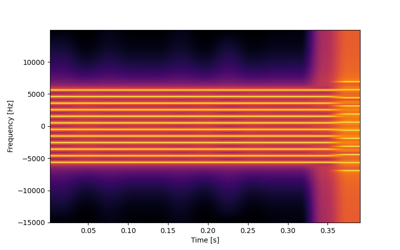

# Sigfox Monarch Beacon Generator
This repository contains a simple python script to generate Sigfox Monarch beacons and to transmit them with any SoapySDR-compatible and transmit-capable software defined radio.



Using the script, you can easily check if your Sigfox end device is capable of detecting Monarch beacons.
The signal generation was developed based on the official [Monarch physical interface description and hardware device requirements](https://www.disk91.com/wp-content/uploads/2019/09/Monarch_physical_interface_description_and_device_HW_requirements_v1.2_external.pdf) document by Sigfox and was confirmed to work with Sigfox Monarch-capable end devices.

## Usage
```
usage: transmit.py [-h] [-r RC] [-s SAMPLINGRATE] [-d DEVICESTRING] [-i INTERVAL] [-g GAIN] [-o OFFSET] [-m MODE] [-p]

Generate Sigfox Monarch Beacon and transmit using SoapySDR

optional arguments:
  -h, --help            show this help message and exit
  -r RC, --rc RC        Radio configuration (rc1, rc2, rc3, rc4, rc5, rc6 or rc7)
  -s SAMPLINGRATE, --samplingrate SAMPLINGRATE
                        Sampling rate for transmit Signal (Hz)
  -d DEVICESTRING, --devicestring DEVICESTRING
                        SoapySDR device string
  -i INTERVAL, --interval INTERVAL
                        Interval in which Monarch beacon is transmitted (seconds)
  -g GAIN, --gain GAIN  Transmit Gain
  -o OFFSET, --offset OFFSET
                        Frequency offset from transmitter's center frequency
  -m MODE, --mode MODE  Mode (normal / pattern1 / pattern2)
  -p, --stop            Transmit beacon only once, then stop
```

## Example
Transmit Sigfox RC3 Monarch beacon every 10 seconds:
```
./transmit.py -r rc3 -i 10
```